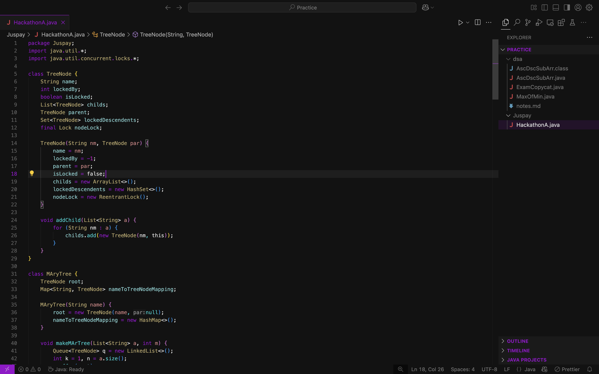

# VIORA

A sleek, minimal dark theme for Visual Studio Code with vibrant neon purple accents.

## Description

**Viora** is a meticulously crafted dark theme designed to provide a comfortable and focused coding experience. It combines a deep, dark background with striking neon purple highlights, creating a visually appealing and productive environment. The theme aims to minimize distractions, allowing you to concentrate on your code while still providing clear syntax highlighting and a modern aesthetic.

## Key Features

- **Deep Dark Background:** Reduces eye strain, making it ideal for extended coding sessions.
- **Vibrant Neon Purple Accents:** Highlights important syntax elements, active interface components, and key navigation, improving code readability and workflow.
- **Clean and Minimalist Design:** Eliminates unnecessary visual clutter, promoting a focused and efficient coding experience.
- **Enhanced Syntax Highlighting:** Provides clear and consistent syntax highlighting for a variety of programming languages, making code easier to understand at a glance.
- **Custom Terminal Color Scheme:** Offers a cohesive and visually pleasing terminal experience that complements the editor theme.
- **Semantic Highlighting:** Uses semantic information to provide more accurate and consistent highlighting.

## Installation

1.  Open **Visual Studio Code**.
2.  Go to the **Extensions** view (`Ctrl+Shift+X` or `Cmd+Shift+X`).
3.  Search for `Neon Hex (Purple)`.
4.  Click **Install**.
5.  Open the **Color Theme** picker:
    - Go to `File` > `Preferences` > `Color Theme`
    - OR Press `Ctrl+K Ctrl+T` (Windows) or `Cmd+K Cmd+T` (macOS)
6.  Select **Neon Hex (Purple)** from the list.

## Detailed Color Breakdown

Here's a breakdown of the primary colors used in Neon Hex (Purple):

- **Base Editor Colors**

  - `#263238`: Editor background, Activity Bar, Side Bar, Status Bar, Title Bar, Terminal Background, Panel Background
  - `#eeffff`: Default text color, Activity Bar Foreground, Editor Foreground, Terminal Foreground
  - `#bbbbbb`: Secondary text color, Side Bar Foreground, Status Bar Foreground, Title Bar Active Foreground, Title Bar Inactive Foreground, Tab Inactive Foreground, Panel Title Inactive Foreground
  - `#37474f`: Side Bar Section Header Background, Editor Line Highlight Background, Tab Active Background, Dropdown Background, Input Background, Panel Border
  - `#546e7a`: Editor Line Number Foreground, Title Bar Inactive Foreground, Comments
  - `#ffffff20`: Editor Whitespace Foreground
  - `#ffffff10`: Editor Indent Guide Background 1
  - `#ffffff30`: Editor Indent Guide Active Background 1

- **Accent Colors**

  - `#c792ea`: Primary accent color - Editor Cursor, Keywords, Active Tab Foreground, Tab Active Border Top, Tab Unfocused Active Border Top, Status Bar Debugging Background, Panel Title Active Foreground, Button Background, List Highlight Foreground, Terminal ANSI Magenta, Terminal ANSI Bright Magenta
  - `#007acc`: Activity Bar Badge Background
  - `#ffffff`: Activity Bar Badge Foreground, Button Foreground, Status Bar Debugging Foreground
  - `#546e7a50`: Editor Selection Background, List Active Selection Background, List Inactive Selection Background, Dropdown Border, Input Border
  - `#546e7a30`: Editor Selection Highlight Background, List Hover Background
  - `#c792ea80`: Tab Unfocused Active Border Top
  - `#89ddff`: Terminal ANSI Blue, Terminal ANSI Bright Blue, Terminal ANSI Cyan, Terminal ANSI Bright Cyan, Property
  - `#c3e88d`: Strings, Terminal ANSI Green, Terminal ANSI Bright Green
  - `#ff5370`: Terminal ANSI Red, Terminal ANSI Bright Red
  - `#ffcb6b`: Terminal ANSI Yellow, Terminal ANSI Bright Yellow, Classes/Types/Enums
  - `#f78c6c`: Numbers
  - `#82aaff`: Functions
  - `#f07178`: Parameter

- **UI Element Colors**

  - `#c792ea50`: Dropdown Border, Input Border
  - `#c792ea`: Input Option Active Border, Button Background
  - `#d1aaff`: Button Hover Background
  - `#546e7a50`: List Active Selection Background
  - `#eeffff`: List Active Selection Foreground, List Hover Foreground, Input Foreground
  - `#546e7a30`: List Hover Background
  - `#eeffff`: List Inactive Selection Foreground

- **Semantic Highlighting Colors**
  - `#82aaff`: Function
  - `#ffcb6b`: Class, Type, Enum
  - `#eeffff`: Variable
  - `#f07178`: Parameter
  - `#89ddff`: Property

## Issues and Feedback

If you encounter any issues or have suggestions for improvement, please feel free to open an issue on the [GitHub repository](link-to-your-github-repository).

## License

[MIT License](./LICENSE)

## Author

[Aditya Mali](https://adityamali.com)

---

Thank you for choosing Neon Hex (Purple)! Enjoy a productive and visually pleasing coding experience.
